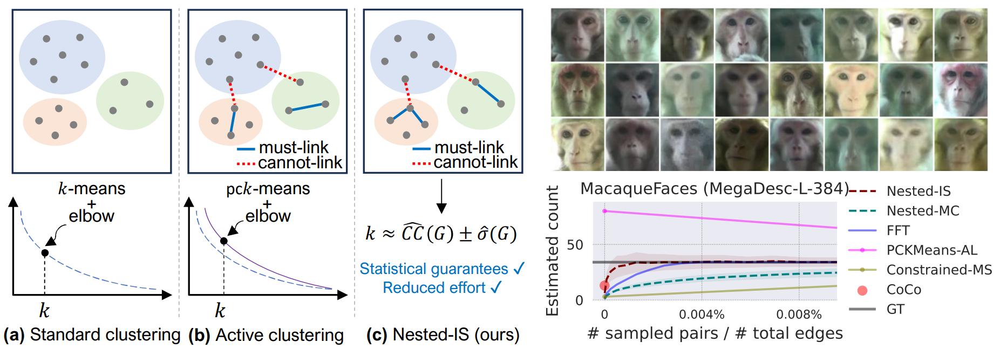
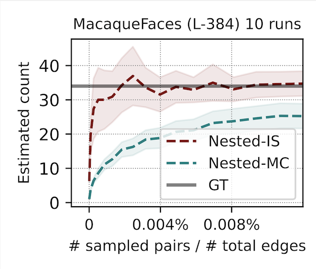

# Human-in-the-Loop Visual Re-ID for Population Size Estimation



We develop a human-in-the-loop approach for estimating the number of clusters in a dataset guided by pairwise similarity. We use this to estimate population size in animal datasets given a Re-ID model, as well as to estimate the number of categories in a dataset using CLIP features. Our approach uses nested importance sampling to directly estimate the number of clusters and provides more accurate estimates than _k_-means with the Elbow heuristic or active clustering approaches. It also provides confidence intervals which get narrower with human vetting. See our paper [Human-in-the-Loop Visual Re-ID for Population Size Estimation](https://arxiv.org/abs/2312.05287) at ECCV'24 for details.


Below is python implementation of our approach for animal Re-ID. This project builds on [wildlife-datasets](https://github.com/WildlifeDatasets/wildlife-datasets) which provide an API to download more than 35 animal Re-ID datasets. The authors also provide a [mega descriptor](https://huggingface.co/BVRA/MegaDescriptor-L-384) library with multiple models to compute species-agnostic features for Re-ID. However, the Re-ID performance varies across species making it challenging to accurately estimate the number of unique individuals (or population size) from an image collection.

## Getting started

1. **Install Anaconda:** We recommend using the free [Anaconda Python
distribution](https://www.anaconda.com/download/) to handle package dependencies. Make sure to download the Python 3 version.

1. **Anaconda virtual environment:** To set up and activate the virtual environment,
run:
```
conda create -n counting-clusters python=3.*
conda activate counting-clusters
```

1. To install **requirements**, run:
```
conda install --yes --file requirements.txt
```

1. **PyTorch:** Install pytorch following the instructions [here](https://pytorch.org/).

1. Install [**wildlife-datasets**](https://github.com/WildlifeDatasets/wildlife-datasets) (see their repo for details).
```
pip install wildlife-datasets
```


## Compute MegaDescriptor Features

This repository uses the [MegaDescriptor-L-384](https://huggingface.co/BVRA/MegaDescriptor-L-384) model and the wildlife-datasets API. The datasets are downloaded into `data/` folder in the current directory but can be changed in `src/config.py`. Below we show how to estimate the number of individuals on the MacaqueFaces dataset which has 6280 images of 34 individuals.


To compute the image features for MacaqueFaces dataset run:

```
CUDA_VISIBLE_DEVICES=0 python compute_features.py --dataset MacaqueFaces --cuda
```

Computing the features for the entire dataset takes 2-3 minutes on a RTX 2080 Ti GPU and around 1 hour on a CPU.
This repository is ready to run with any of the wildlife-datasets included in our paper (i.e., CTai, CZoo, MacaqueFaces, WhaleSharkID, GiraffeZebraID, OpenCows2020, and IPanda50).
Modify `load_dataset()` in `src/utils_.py` to add additional datasets.

The features will be saved into `features/<dataset name>/` as `<model>_<pretraining>.npy` and the metadata (labels, filenames, etc.) as `<model>_<pretraining>_meta.json`.
You can load them using:

```
from utils_ import load_features

args = lambda:0
args.dataset = 'MacaqueFaces'
args.feats_dir = 'features'
args.model = 'L-384'
args.pretraining = 'megad'
features, meta = load_features(args)

print(features.shape)
print(len(meta))
print(meta[0])
```

The code above  should display:
```
>>> (6280, 1536)
>>> 6280
>>> {'id': 0, 'label': 0, 'filename': 'MacaqueFaces/Random/Teal/Macaque_Face_5185.jpg'}
```

## Estimating the Number of Clusters: Baselines

Given some features, some baseline approaches to compute the number of clusters in a dataset include _k_-means + Elbow heuristic, thresholding the pairwise similarity and counting the number of connected components, robust continuous clustering, etc. None of these approaches are robust when the pairwise similarity is noisy, and Table 1 in the paper shows that in some cases the estimated number of clusters can be off by a factor of 10.

## Estimating the Number of Clusters: Human in-the-Loop Approaches

The estimates can be improved by asking humans to provide feedback on pairs of data points. For example, in the Re-ID task, given a pair of images, an expert can annotate if the images belong to the same individual or not. For a dataset of size _n_, there are _n(n-1)_ pairs to consider, which quickly becomes impractical.

Active clustering approaches such as constrained _k_-means incorporate a small number of pairwise constraints within the objective to improve clustering. These constraints can be incorporated into other clustering approaches too. In the paper, we compare our approach to these and also propose a farthest-first traversal (FFT) scheme that quickly explores the dataset to find new clusters

Our approach provides a statistical estimate of the number of clusters based on a way to count the connected components as the sum of inverse degrees of each node (see paper for details). We can form an estimate by Monte Carlo sampling. This involves sampling a few vertices and querying humans to estimate the degree of each node. While this estimator is asymptotically unbiased, it can have high variance and does not use the underlying pairwise similarity. We develop an importance sampling-based estimator using the approximate pairwise similarity. We derive a confidence interval by constructing an estimator of the variance under a Gaussian assumption for both cases.

The code provides an implementation of the nested-MC and nested-IS approaches. By default, the script will run each 10 times with approximately 70 different numbers of samples (pairwise comparisons) for human vetting. It then computes the average estimates and confidence intervals across these runs. The script will take around 1 minute for the MacaqueFaces dataset. You can run the estimator with:
```
python run_estimator.py --dataset MacaqueFaces --runs 10
```
The previous command line should display the following:
```
>>> [loading MacaqueFaces-L-384-megad features...] done (6280, 1536) [0.0s]
>>> [creating GT matrix...] done (6280, 6280) [4.4s]
>>> [calculating similarity matrix (cosine)...] done (6280, 6280) [18.8s]
>>> [running nested-MC and nested-NIS (10 runs)...] done [0.8m]
```

The script will save the results as `results_MacaqueFaces_L-384_megad.pdf`. You can see the estimates converging to the true value and the confidence intervals getting narrower with more effort.

<br>


In the paper we report results using 100 trials which provides more accurate estimates, but takes longer to run. Also see the paper for a comparison with baselines and active clustering approaches. Our estimates are within 10\% of the true counts using human effort on less than 0.2\% of the edges, with some smaller datasets requiring less than 0.01\% of the edges.


## Cite

If you find this code useful in your research, please consider citing:
```
@inproceedings{perez2024human,
  author = {Perez, Gustavo and Sheldon, Daniel and Van Horn, Grant and Maji, Subhransu},
  title = {Human-in-the-Loop Visual Re-ID for Population Size Estimation},
  booktitle = {European Conference on Computer Vision (ECCV)},
  year = 2024,
}
```

## Related work

You might find the following projects of interest:

* [ISCount](https://ojs.aaai.org/index.php/AAAI/article/view/21462), Meng et al., AAAI'22 – uses covariate-based importance sampling to count in large image collections.
* [DISCount](https://ojs.aaai.org/index.php/AAAI/article/view/30235), Perez et al., AAAI'24 – uses detector-based importance sampling to count in large image collections.
* [Prediction Powered Inference](https://www.science.org/doi/full/10.1126/science.adi6000), Angelopoulos et al., Science'23 – provides a way to estimate population mean and other quantities by combining true predictions and model predictions.

Our approach uses importance sampling similar to ISCount and DISCount but tackles the novel setting of estimation involving pairwise constraints.


## Acknowledgements

This work is supported by the National Science Foundation (NSF) of the United States under grants \#1749854, \#1749833, and \#2329927. We thank Hung Le for initial discussions and the Wildlife Datasets team for publicly releasing the datasets and models for animal Re-ID.
